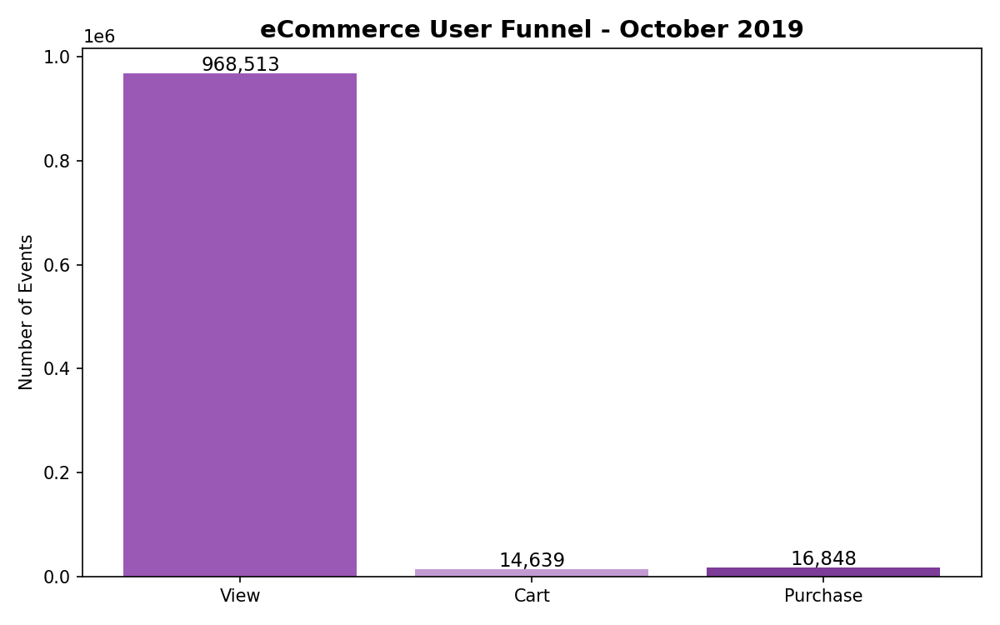
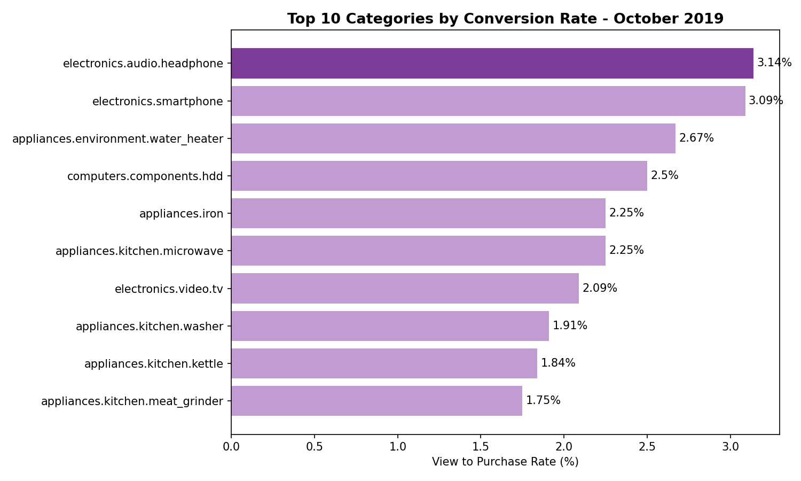
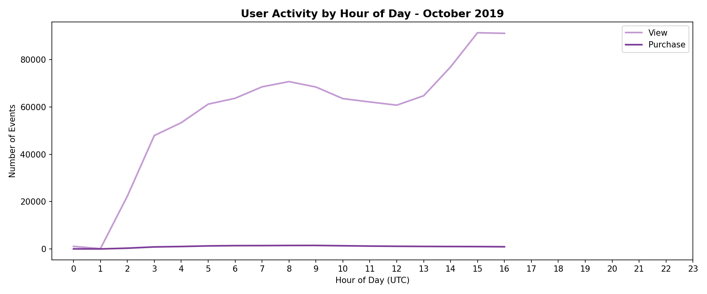

# ecommerce-funnel-analysis
Product analytics project analyzing user drop-off patterns in an ecommerce funnel using Python
# eCommerce Funnel Analysis
**Tools:** Python, pandas, matplotlib, seaborn  
**Data:** 1M events from a multi-category eCommerce store (October 2019)

## Overview
This project analyzes user behavior data from a large eCommerce platform to identify where and why potential customers drop off before completing a purchase.

## Key Findings

**1. Massive drop-off from view to purchase**  
Only 1.74% of product views resulted in a purchase, and 1.51% resulted in a cart add — meaning 98% of browsing sessions did not convert.

**2. Electronics convert best**  
Headphones (3.14%) and smartphones (3.09%) had the highest view-to-purchase rates, suggesting high purchase intent in electronics. Kitchen appliances like meat grinders (1.75%) had the worst conversion.

**3. Direct purchase path exists**  
More purchases occurred than cart adds (16,848 vs 14,639), indicating a significant portion of users bypassed the cart entirely via a direct "buy now" path.

**4. Activity peaks in early UTC hours**  
User activity ramps up sharply around hours 1-3 UTC and peaks around 7-8 UTC, consistent with European evening and morning shopping patterns.

## Visualizations

## Limitations
Analysis is based on a 1 million row sample of the full dataset. Hourly activity data is skewed toward early hours due to sampling from the beginning of the month.
